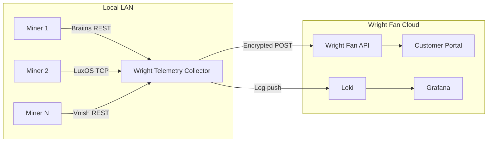
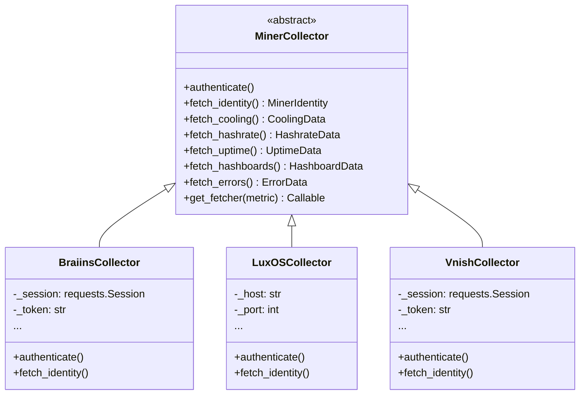
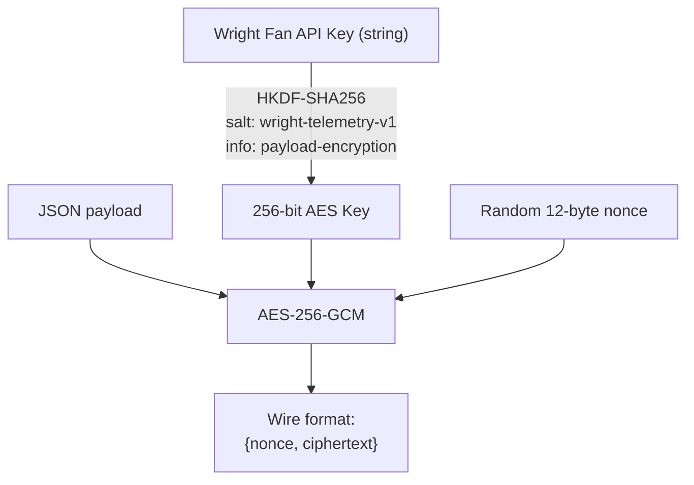
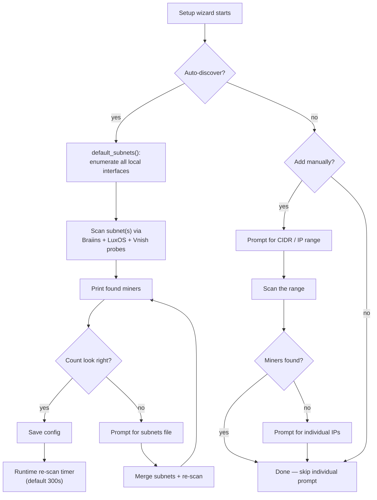

# Architecture

Technical reference for developers and contributors.

---

## System Overview



The collector runs on any machine on the same LAN as the mining rigs. It polls each miner's local API (Braiins REST, LuxOS TCP, or Vnish REST), encrypts the payload, and POSTs it to the Wright Fan cloud API. Operational logs are shipped to Loki for centralized monitoring.

---

## Project Structure

```
wright_telemetry/
    __init__.py          # package version
    __main__.py          # CLI entry point (argparse)
    config.py            # load/save config + interactive setup wizard
    consent.py           # per-metric consent management
    discovery.py         # network scanning & miner auto-discovery
    encryption.py        # AES-256-GCM with HKDF key derivation
    api_client.py        # Wright Fan API HTTP client
    models.py            # dataclass models for all metric types
    scheduler.py         # polling loop with crash recovery
    logging_setup.py     # stdout + rotating file + Loki handler
    service.py           # OS service install (systemd / launchd / schtasks)
    collectors/
        __init__.py
        base.py          # abstract MinerCollector interface
        factory.py       # registry-based factory
        braiins.py       # Braiins OS REST adapter
        luxos.py         # LuxOS CGMiner TCP adapter
        vnish.py         # Vnish firmware REST adapter
```

---

## Adapter Pattern

New miner backends are added by subclassing `MinerCollector` and registering with the factory:



### Adding a New Backend

1. Create `wright_telemetry/collectors/your_backend.py`
2. Subclass `MinerCollector` and implement all abstract methods
3. Decorate the class with `@CollectorFactory.register("your_backend")`
4. Import the module in `__main__.py` so the decorator runs

```python
from wright_telemetry.collectors.base import MinerCollector
from wright_telemetry.collectors.factory import CollectorFactory

@CollectorFactory.register("vnish")
class VnishCollector(MinerCollector):
    def authenticate(self) -> None: ...
    def fetch_identity(self) -> MinerIdentity: ...
    def fetch_cooling(self) -> CoolingData: ...
    def fetch_hashrate(self) -> HashrateData: ...
    def fetch_uptime(self) -> UptimeData: ...
    def fetch_hashboards(self) -> HashboardData: ...
    def fetch_errors(self) -> ErrorData: ...
```

---

## Braiins OS API Endpoints

| Metric     | Endpoint                          | Response (key fields)                                  |
|------------|-----------------------------------|--------------------------------------------------------|
| cooling    | `GET /api/v1/cooling/state`       | `fans[].rpm`, `fans[].target_speed_ratio`, `highest_temperature` |
| hashrate   | `GET /api/v1/miner/stats`         | `miner_stats`, `pool_stats`, `power_stats`             |
| uptime     | `GET /api/v1/miner/details`       | `bosminer_uptime_s`, `system_uptime_s`, `uid`, `serial_number` |
| hashboards | `GET /api/v1/miner/hw/hashboards` | `hashboards[].highest_chip_temp`, `board_temp`, etc.   |
| errors     | `GET /api/v1/miner/errors`        | `errors[].message`, `timestamp`, `error_codes`         |

Authentication: `POST /api/v1/auth/login` with `{"username": "...", "password": "..."}` returns `{"token": "..."}`. The token is sent as `Authorization: Bearer <token>` on subsequent requests. The adapter auto-refreshes on 401.

---

## LuxOS API (CGMiner TCP on port 4028)

| Metric     | Command            | Response (key fields)                                  |
|------------|--------------------|--------------------------------------------------------|
| identity   | `config`           | `CONFIG[].SerialNumber`, `Hostname`, `MACAddr`         |
| cooling    | `fans` + `temps`   | `FANS[].RPM`, `Speed`; `TEMPS[].Board`, `Chip`        |
| hashrate   | `summary` + `pools` + `power` | `SUMMARY[].GHS 5s`, `POOLS[].URL`, `POWER[].Watts` |
| uptime     | `summary` + `version` + `config` | `Elapsed`, `LUXminer`, `API`              |
| hashboards | `devs` + `temps`   | `DEVS[].MHS av`, `Temperature`, `SerialNumber`         |
| errors     | `events`           | `EVENTS[].Description`, `Code`, `CreatedAt`            |

No authentication required for read-only telemetry queries.

---

## Vnish API Endpoints

| Metric     | Endpoint               | Response (key fields)                                  |
|------------|------------------------|--------------------------------------------------------|
| identity   | `GET /api/v1/info`     | `uid`, `serial`, `hostname`, `mac`, `firmware_version` |
| cooling    | `GET /api/v1/status`   | `fans[].rpm`, `speed_pct`; `chains[].temp_board`, `temp_chip` |
| hashrate   | `GET /api/v1/summary`  | `miner.instant_hashrate`, `pools[]`, `power.watts`     |
| uptime     | `GET /api/v1/info` + `GET /api/v1/summary` | `firmware_version`, `miner.uptime` |
| hashboards | `GET /api/v1/status`   | `chains[].temp_board`, `temp_chip`, `chips`, `hashrate` |
| errors     | `GET /api/v1/status`   | `errors[].message`, `code`, `timestamp`                |

Authentication: `POST /api/v1/unlock` with `{"pw": "..."}` returns `{"token": "..."}`. The token is sent as `Authorization: <token>` on subsequent requests. System-level commands use `Authorization: Bearer <token>`. The adapter auto-refreshes on 401.

---

## Encryption Scheme

All telemetry payloads are encrypted before leaving the customer's network.



- Key derivation: HKDF-SHA256 with fixed salt `wright-telemetry-v1` and info `payload-encryption`
- Encryption: AES-256-GCM with a random 12-byte nonce per payload
- Wire format: `{"nonce": "<base64>", "ciphertext": "<base64>"}`
- The ciphertext includes the GCM authentication tag (appended by the `cryptography` library)
- The server derives the same key from the stored API key

---

## Wright Fan API Contract

```
POST {wright_api_url}/v1/telemetry
Headers:
    Content-Type: application/json
    X-API-Key: {api_key}
    X-Facility-ID: {facility_id}
Body: {"nonce": "...", "ciphertext": "..."}
```

`wright_api_url` must be the full API base URL for your environment (the collector appends `/v1/telemetry`, `/v1/ws/agent`, and so on). Production is typically `https://api.wrightfan.com`; development often uses `https://dev.wrightfan.com/api`, with `/api` included in the configured base rather than in those path suffixes.

Decrypted payload structure:

```json
{
    "metric_type": "cooling",
    "timestamp": "2026-03-22T12:00:00Z",
    "facility_id": "abc123",
    "miner_identity": {
        "uid": "...",
        "serial_number": "...",
        "hostname": "...",
        "mac_address": "..."
    },
    "data": { }
}
```

The `miner_identity` block is included in every POST so the portal can map fan serial numbers (from QR scans) to specific `(miner_uid, fan_position)` pairs without the collector needing to know about fan serials.

---

## Discovery & Auto-Scan

The collector can find miners on the network automatically so operators don't have to punch in IPs by hand.



### Subnet auto-detection (`default_subnets`)

`default_subnets()` in `discovery.py` enumerates all local IPv4 interfaces using `socket.getaddrinfo(socket.gethostname(), None, AF_INET)`, supplemented by the UDP-trick primary-route IP from `get_local_ip()`. Loopback addresses are filtered and duplicate /24s are deduplicated. This covers trunk-port and VLAN sub-interface setups automatically.

`default_subnet()` (singular) is a backwards-compat wrapper that returns the first result or `None`.

### Subnets file (`--subnets-file`)

For sites where the collector host doesn't have interfaces on every VLAN, operators can supply a plain text file:

```
# One CIDR or IP range per line; # comments and blank lines ignored
192.168.1.0/27
192.168.2.0/27
192.168.3.0/27
```

`load_subnets_file(path)` in `discovery.py` parses this format. The `--subnets-file FILE` CLI flag calls it, writes the resulting list to `discovery.subnets` in config, and runs a scan. The setup wizard also prompts for a file path when the user indicates the auto-detected miner count looks wrong.

### How probing works

Each IP in the target range is probed concurrently (up to 128 threads). Three probe functions run per IP:

| Probe | Method | Positive signal |
|-------|--------|-----------------|
| Braiins | `GET /api/v1/miner/details` | HTTP 200 or 401 |
| LuxOS | TCP 4028 `{"command":"version"}` | Response contains `LUXminer` |
| Vnish | `GET /api/v1/info` | HTTP 200, response contains `firmware_version` |

Probes time out after 2 seconds. Results are sorted by IP and deduplicated by MAC address when merging with existing config.

### Runtime re-scan

When `discovery.scan_interval_seconds > 0`, the scheduler periodically re-scans the configured subnets and merges new miners into the live config. MAC address is the primary dedup key; if a miner's DHCP lease changes, the existing entry's URL is updated rather than creating a duplicate.

### Wizard flow for manual/range entry

When the user opts to add miners manually, the wizard first offers a CIDR or IP range scan. If that scan discovers miners, they are added automatically and the individual-IP prompt is skipped entirely — no reason to type IPs one by one when the scan already found them. The individual-IP fallback only appears if the range scan found nothing or was skipped.

---

## Config File Schema

Location: `~/.wright-telemetry/config.json`

```json
{
    "wright_api_key": "string",
    "wright_api_url": "string (default: https://api.wrightfan.com — full API base; use https://dev.wrightfan.com/api for dev)",
    "facility_id": "string",
    "poll_interval_seconds": 30,
    "consent": {
        "cooling": false,
        "hashrate": false,
        "uptime": false,
        "hashboards": false,
        "errors": false
    },
    "collector_type": "braiins",
    "discovery": {
        "enabled": true,
        "subnets": ["192.168.1.0/24", "192.168.2.0/27"],  // one or more CIDRs or IP ranges
        "scan_interval_seconds": 300,
        "default_username": "root",
        "default_password_b64": "string (base64, optional)"
    },
    "miners": [
        {
            "name": "string (friendly label or hostname)",
            "url": "string (e.g. http://192.168.1.100)",
            "username": "string (optional)",
            "password_b64": "string (base64, optional)",
            "discovered": "boolean (true if found by auto-scan)",
            "firmware": "string (braiins, luxos, etc.)",
            "mac_address": "string (optional, used for dedup)",
            "wright_fans": "boolean (optional)"
        }
    ]
}
```

File permissions are set to `0600` on creation.

---

## Fault Tolerance

### Inner Layer (process stays alive)

- Per-miner, per-metric `try/except` in the poll loop
- A single miner being down or a single API call failing never kills the loop
- Failed metrics are logged and skipped; the next miner/metric proceeds normally

### Outer Layer (crash recovery)

- Top-level `try/except` around the entire run loop in `scheduler.py`
- On unhandled exception: log traceback, wait with exponential backoff (10s, 20s, 40s... max 5 min), restart from scratch (re-auth, re-fetch identities, resume polling)
- Backoff resets to zero after a successful startup

### OS Layer (survive reboots)

| Platform | Mechanism | Restart Policy |
|----------|-----------|----------------|
| Linux    | systemd user service | `Restart=always`, `RestartSec=10` |
| macOS    | launchd LaunchAgent | `KeepAlive=true`, `RunAtLoad=true` |
| Windows  | Task Scheduler | On startup, inner crash recovery handles restarts |

Install: `wright-telemetry --install`, Uninstall: `wright-telemetry --uninstall`

---

## Loki Remote Logging

Operational logs (not telemetry data) are shipped to `logs.wrightfan.com` via Loki's push API. This is always-on and not part of user consent.

- Handler: custom `logging.Handler` subclass in `logging_setup.py`
- Batching: up to 100 entries or 10 seconds, whichever comes first
- Labels: `{job="wright-telemetry", facility_id, collector_version, hostname}`
- Auth: Basic auth, credentials resolved via `WRIGHT_LOKI_AUTH` env var (injected at build time from GitHub Secrets)
- Failure mode: silent drop -- never blocks telemetry collection

---

## Building Locally

```bash
# Install dependencies
pip install -r requirements.txt
pip install pyinstaller

# Run from source
python -m wright_telemetry

# Build a standalone binary
pyinstaller wright-telemetry.spec

# Binary is at dist/wright-telemetry
```

---

## GitHub Actions CI

Five workflows in `.github/workflows/`:

| Workflow | Runner | Purpose |
|----------|--------|---------|
| `braiins-test.yml` | `ubuntu-latest` (Python 3.11) | Runs the Braiins test suite on every PR and push to main |
| `luxos-test.yml` | `ubuntu-latest` (Python 3.11) | Runs the LuxOS test suite on every PR and push to main |
| `vnish-test.yml` | `ubuntu-latest` (Python 3.11) | Runs the Vnish test suite on every PR and push to main |
| `build-linux.yml` | `ubuntu-latest` | Tests + build Linux binary |
| `build-macos.yml` | `macos-latest` | Tests + build macOS binary |
| `build-windows.yml` | `windows-latest` | Tests + build Windows binary |

Each build workflow:
1. Checks out code
2. Sets up Python 3.11
3. Installs dependencies + PyInstaller + test deps
4. **Runs the test suite** (build is blocked if tests fail)
5. Builds with `WRIGHT_LOKI_AUTH` from GitHub Secrets
6. Verifies the binary runs (`--version`)
7. Generates SHA256 checksum
8. Uploads artifact (always)
9. Uploads release asset (on version tags like `v0.1.0`)
